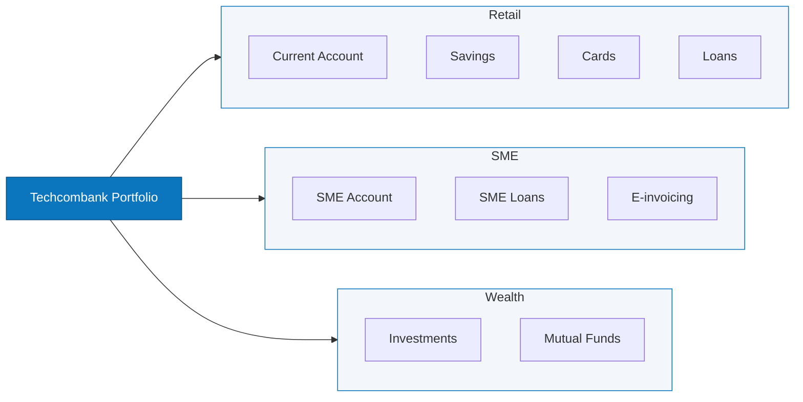
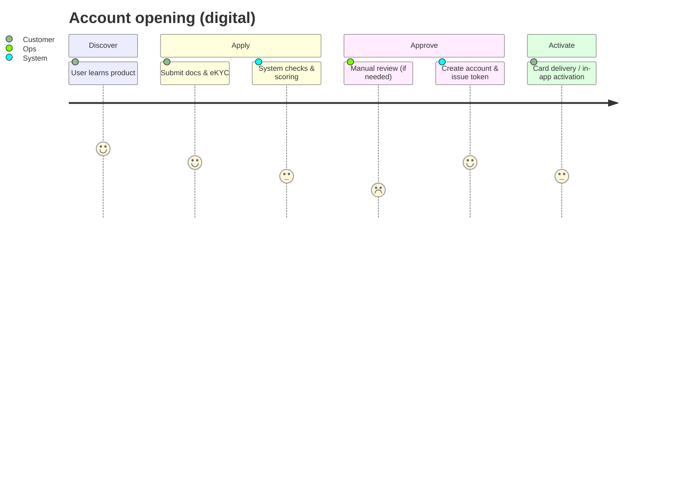
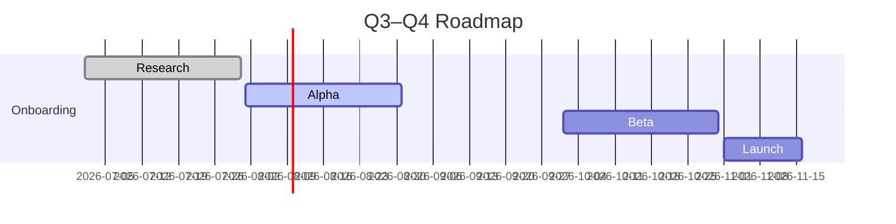

# Techcombank — Product Engineering Playbook

Concise, production-ready artifacts a Senior Product Owner at Techcombank would use. Visual-first, decision-focused, ready for handoff to PMs, EMs and stakeholders.

Quick links

- Docs: [docs/product-spec.md](docs/product-spec.md)
- Roadmap: [docs/roadmap.md](docs/roadmap.md)
- Templates: [templates/REQ_TEMPLATE.md](templates/REQ_TEMPLATE.md)

---

## Portfolio (visual)

## Short product catalog (concise)

- Current Account — core transactional product for retail customers (digital-first onboarding, debit + e-statements).
- Savings — tiered accounts and goal-based savings tools.
- Cards — credit/debit products with rewards + installment plans.
- Loans — consumer & mortgage; fast decisioning for salaried customers.
- SME Account — business banking for micro / small businesses (payments, cash mgmt).
- SME Loans — working capital and trade finance for SMEs.
- E-invoicing — SME automation & partner integrations (AP/AR).
- Investments — brokerage and funds for retail investors.

---

## User journey — account opening (visual)

## Roadmap snapshot

## Stakeholders & outputs

- **Outputs in this repo:** `docs/product-spec.md`, `templates/REQ_TEMPLATE.md`, `templates/PR_TEMPLATE.md`, `docs/monitoring-checklist.md`, diagrams in `/diagrams`.
- **Stakeholders:** Business, Engineering, Compliance, Ops, Marketing.

---

If you want more visuals (colored swimlanes, persona cards, or export-ready PNGs), tell me which diagram to expand and I will commit & push updates.
