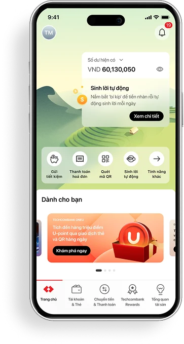
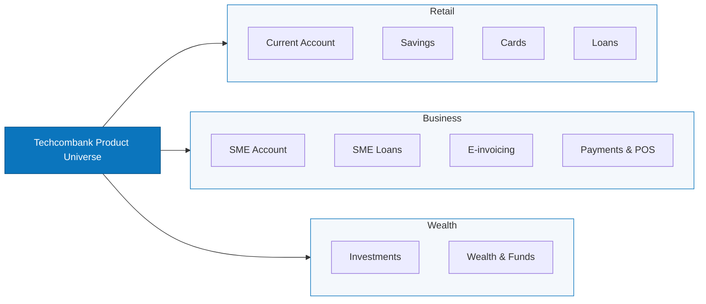
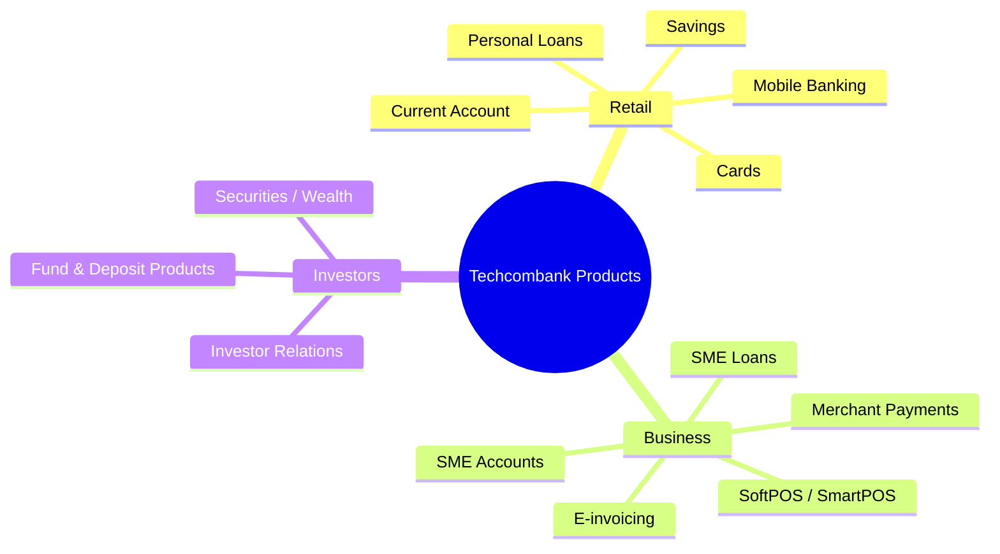
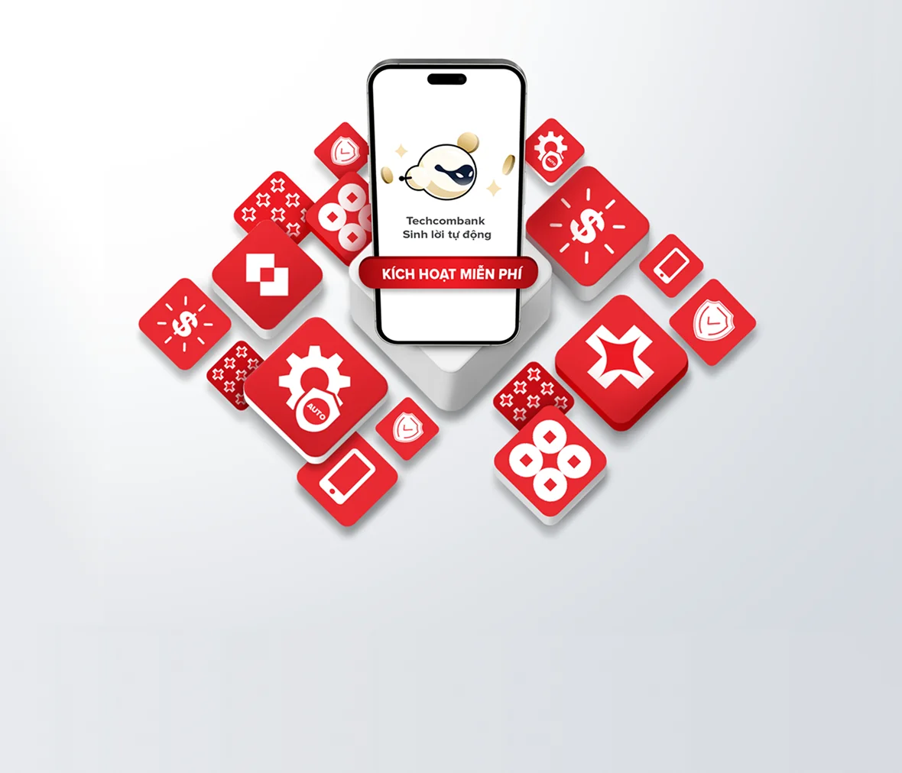
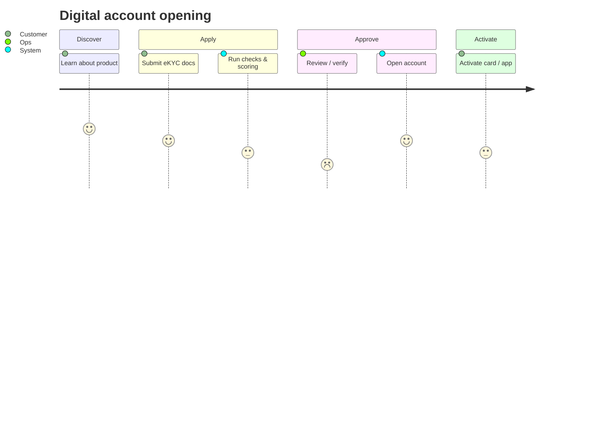

# Techcombank — Product Engineering Playbook

## Quick links

- Docs: [docs/product-spec.md](docs/product-spec.md)
- Roadmap: [docs/roadmap.md](docs/roadmap.md)
- Templates: [templates/REQ_TEMPLATE.md](templates/REQ_TEMPLATE.md)
- Monitoring: [docs/monitoring-checklist.md](docs/monitoring-checklist.md)

---

## Techcombank product landscape

### Customer segments

- Retail: personal banking, cards, savings, loans, mobile banking.
- Business: SME accounts, merchant payments, digital invoicing, working capital.
- Wealth / Investors: investments, funds, investor communications.

---

## Product lines by customer type

---

## Core product themes

- Savings & deposit products — growth, liquidity, automatic interest features.
- Payments & transaction rails — card, QR, merchant, and account transfers.
- Credit & lending — personal loans, SME working capital, installment offers.
- Digital banking — onboarding, self-service, mobile-first experience.
- Enterprise / merchant tools — POS, merchant onboarding, business cash management.

---

## Customer journey: digital onboarding

---

## Roadmap snapshot

---

## Internal-ready structure

- Product spec: [docs/product-spec.md](docs/product-spec.md)
- Requirement template: [templates/REQ_TEMPLATE.md](templates/REQ_TEMPLATE.md)
- PR template: [templates/PR_TEMPLATE.md](templates/PR_TEMPLATE.md)
- Monitoring checklist: [docs/monitoring-checklist.md](docs/monitoring-checklist.md)
- Stakeholder map: [docs/stakeholder-map.md](docs/stakeholder-map.md)

 